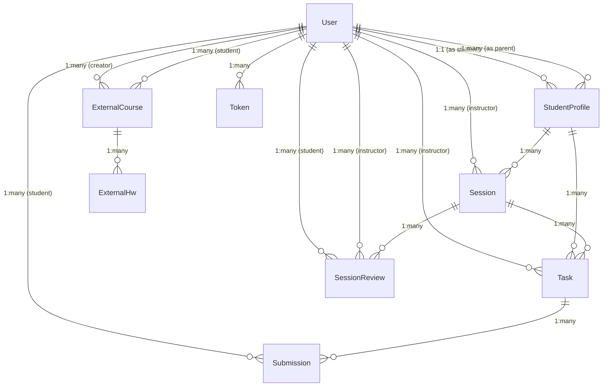

# LMS Database ER Diagram

## Entity Descriptions

### User
- **Attributes**: FullName, UserName, Email, Password, Role, Avatar, isActive
- **Relationships**:
  - 1:1 with StudentProfile (when role is student)
  - 1:many with StudentProfile (as parent)
  - 1:many with Session (as instructor)
  - 1:many with Task (as instructor)
  - 1:many with Submission (as student)
  - 1:many with SessionReview (as student or instructor)
  - 1:many with ExternalCourse (as creator or student)
  - 1:many with Token

### StudentProfile
- **Attributes**: User (ref), Parents (array ref), Grade, Notes
- **Relationships**:
  - 1:1 with User (student)
  - 1:many with User (parents)
  - 1:many with Session
  - 1:many with Task

### Session
- **Attributes**: Title, Description, RecapVideoLinks, AttachmentsLinks, StudentProfileId, InstructorId, Date, StudentAttended, Notes, Summary, Status
- **Relationships**:
  - Many:1 with StudentProfile
  - Many:1 with User (instructor)
  - 1:many with Task
  - 1:many with SessionReview

### Task
- **Attributes**: Title, Description, TaskLinks, DueDate, SessionId, StudentProfileId, InstructorId, Status
- **Relationships**:
  - Many:1 with Session
  - Many:1 with StudentProfile
  - Many:1 with User (instructor)
  - 1:many with Submission

### Submission
- **Attributes**: Task (ref), Student (ref), SubmissionDate, Task_links, Note, Status, Review (score, comment, rating)
- **Relationships**:
  - Many:1 with Task
  - Many:1 with User (student)

### SessionReview
- **Attributes**: Session (ref), Student (ref), Instructor (ref), Notes, Behavior, Understanding, Participation, Coding, OverallRating
- **Relationships**:
  - Many:1 with Session
  - Many:1 with User (student)
  - Many:1 with User (instructor)

### ExternalCourse
- **Attributes**: Teacher, Subject, CreatedBy (ref), Student (ref), Color
- **Relationships**:
  - Many:1 with User (creator)
  - Many:1 with User (student)
  - 1:many with ExternalHw

### ExternalHw
- **Attributes**: Title, Description, DueDate, SubmissionDate, IsSubmitted, Notes, ExternalCourse (ref), SubmissionLinks, Status, Category
- **Relationships**:
  - Many:1 with ExternalCourse

### Token
- **Attributes**: TokenId, UserId (ref), ExpiresAt, TokenHash
- **Relationships**:
  - Many:1 with User