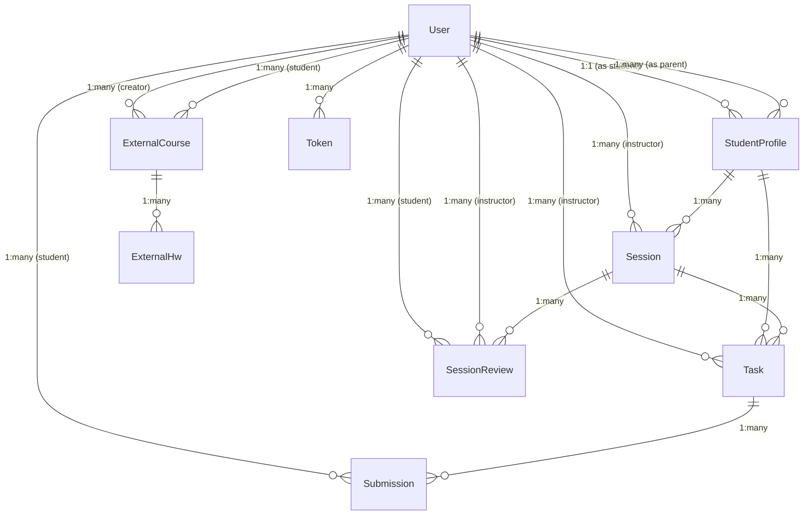

# LMS Backend Presentation

---

## Title Slide

# Learning Management System (LMS) Backend

**Presented by:** [Your Name]  
**Date:** April 11, 2026  

A comprehensive backend solution for educational platforms built with Node.js, Express, and MongoDB.

---

## Agenda

- Project Overview
- Key Features
- System Architecture
- Database Design & Relationships
- Technology Stack
- How to Run & Demo
- Future Enhancements

---

## Project Overview

The LMS Backend is a robust API server that powers educational management systems. It handles:

- User authentication and authorization
- Student profile management
- Session scheduling and tracking
- Task assignment and submission
- Performance reviews and ratings
- External course integration

**Target Users:** Instructors, Students, Parents, Admins

---

## Key Features

### 🔐 Authentication & Security
- JWT-based authentication
- Role-based access control (Instructor, Student, Parent, Admin)
- Secure password hashing
- Rate limiting and CORS protection

### 👥 User Management
- Multi-role user system
- Student-parent relationships
- Profile management

### 📚 Learning Management
- Session scheduling with instructors
- Task assignment with deadlines
- Submission tracking and reviews
- Session performance evaluations

### 📊 Analytics & Reviews
- Multi-criteria session reviews
- Submission scoring and feedback
- Progress tracking

---

## System Architecture

```
┌─────────────────┐    ┌─────────────────┐    ┌─────────────────┐
│   Controllers   │    │    Services     │    │   Utilities     │
│                 │    │                 │    │                 │
│ • Auth          │    │ • Auth Logic    │    │ • Hash Helper   │
│ • User          │    │ • Business      │    │ • JWT Helper    │
│ • Sessions      │    │   Rules         │    │ • Email Helper  │
│ • Tasks         │    │                 │    │ • Validation    │
└─────────────────┘    └─────────────────┘    └─────────────────┘
         │                       │                       │
         └───────────────────────┼───────────────────────┘
                                 │
                    ┌─────────────────┐
                    │   Middleware    │
                    │                 │
                    │ • Auth          │
                    │ • Validation    │
                    │ • Error Handler │
                    └─────────────────┘
                                 │
                    ┌─────────────────┐
                    │     Routes      │
                    │                 │
                    │ • /api/v1/*     │
                    └─────────────────┘
                                 │
                    ┌─────────────────┐
                    │    Express      │
                    │     App         │
                    └─────────────────┘
                                 │
                    ┌─────────────────┐
                    │    MongoDB      │
                    │   (Mongoose)    │
                    └─────────────────┘
```

---

## Database Design

### Entity Relationship Diagram



---

## Entity Details

### User
- **Fields**: FullName, UserName, Email, Password, Role, Avatar, isActive
- **Roles**: instructor, student, parent, admin
- **Relationships**: Central entity connecting all other entities

### StudentProfile
- **Fields**: User (ref), Parents (array ref), Grade, Notes
- **Purpose**: Extends student user with parent relationships

### Session
- **Fields**: Title, Description, Videos, Attachments, StudentProfile, Instructor, Date, Status, Notes
- **Purpose**: Scheduled learning sessions

### Task
- **Fields**: Title, Description, Links, DueDate, Session, StudentProfile, Instructor, Status
- **Purpose**: Assignments tied to sessions

### Submission
- **Fields**: Task, Student, Date, Links, Note, Status, Review (score, comment, rating)
- **Purpose**: Student work submissions with instructor feedback

---

## Technology Stack

### Backend Framework
- **Node.js** - Runtime environment
- **Express.js** - Web framework
- **MongoDB** - NoSQL database
- **Mongoose** - ODM for MongoDB

### Security & Authentication
- **JWT** - JSON Web Tokens
- **bcrypt** - Password hashing
- **Helmet** - Security headers
- **CORS** - Cross-origin resource sharing
- **Rate Limiting** - API protection

### Development Tools
- **Winston** - Logging
- **Nodemailer** - Email service
- **Swagger** - API documentation
- **Joi** - Input validation
- **PM2** - Process management

---

## How to Run

### Prerequisites
```bash
Node.js v16+
MongoDB
npm or yarn
```

### Installation
```bash
# Clone repository
git clone <repo-url>
cd lms-backend

# Install dependencies
npm install

# Setup environment
cp .env.example .env
# Edit .env with your configurations
```

### Running the Application
```bash
# Development
npm run dev

# Production
npm run start:prod

# View API docs
# Visit http://localhost:3000/api-docs
```

---

## API Endpoints Overview

| Module | Endpoint | Description |
|--------|----------|-------------|
| Auth | `/api/v1/auth` | Login, signup, refresh |
| Users | `/api/v1/users` | User CRUD operations |
| Profiles | `/api/v1/student-profiles` | Student profile management |
| Sessions | `/api/v1/sessions` | Session scheduling |
| Tasks | `/api/v1/tasks` | Task assignment |
| Submissions | `/api/v1/submissions` | Submission handling |
| Reviews | `/api/v1/session-reviews` | Performance reviews |
| External | `/api/v1/external-*` | External course management |

---

## Demo Scenarios

### 1. User Registration & Login
- Student/Parent/Instructor signup
- JWT token generation
- Role-based access

### 2. Session Management
- Instructor creates session
- Student attends session
- Materials uploaded

### 3. Task Workflow
- Instructor assigns task
- Student submits work
- Instructor reviews and scores

### 4. Parent Monitoring
- Parents view student progress
- Access session reviews
- Track submissions

---

## Future Enhancements

### Planned Features
- **Real-time Notifications** - WebSocket integration
- **File Upload System** - Cloud storage integration
- **Advanced Analytics** - Dashboard with charts
- **Mobile App API** - Optimized endpoints
- **Integration APIs** - Third-party LMS connections

### Scalability Improvements
- **Microservices Architecture** - Service separation
- **Caching Layer** - Redis integration
- **Load Balancing** - Multiple server instances
- **Database Optimization** - Indexing and sharding

---

## Q&A

Thank you for your attention!

**Questions?**

Contact: [Your Email/Phone]  
GitHub: [Repository Link]