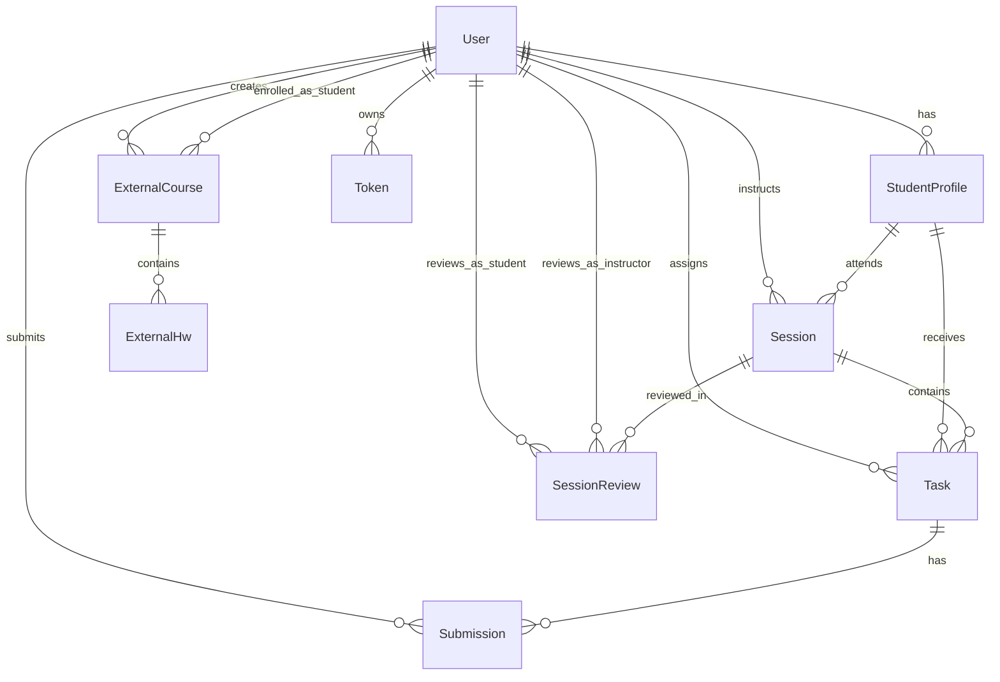

# LMS Backend Project

## Project Overview

This is a Learning Management System (LMS) backend built with Node.js, Express, and MongoDB. It provides a comprehensive platform for managing educational sessions, tasks, submissions, student profiles, and external courses/homework. The system supports multiple user roles: instructors, students, parents, and admins.

## Key Features

- **User Management**: Authentication and authorization with JWT tokens, support for multiple roles.
- **Student Profiles**: Detailed profiles linking students to their parents.
- **Sessions**: Scheduled learning sessions with instructors, including videos, attachments, and notes.
- **Tasks & Submissions**: Assignment management with submission tracking and reviews.
- **Session Reviews**: Performance evaluations with ratings for behavior, understanding, participation, and coding.
- **External Courses & Homework**: Management of external educational content and assignments.
- **Security**: Rate limiting, CORS, helmet for security headers, password hashing.
- **API Documentation**: Swagger integration for API docs.
- **Logging**: Winston for comprehensive logging.
- **Email**: Nodemailer for notifications.

## Architecture

The application follows a modular MVC architecture:

- **Controllers**: Handle business logic and API responses.
- **Models**: Mongoose schemas defining data structures and relationships.
- **Routes**: Define API endpoints.
- **Services**: Business logic layer.
- **Middleware**: Authentication, validation, error handling.
- **Utilities**: Helper functions for hashing, JWT, email, etc.

## Database Schema

The system uses MongoDB with the following main entities and relationships:



### Entity Descriptions

- **User**: Core user entity with roles (instructor, student, parent, admin). Handles authentication.
- **StudentProfile**: Extends user for students, links to parents.
- **Session**: Learning sessions between instructors and students, with materials and status.
- **Task**: Assignments tied to sessions, with due dates and status.
- **Submission**: Student submissions for tasks, with reviews and ratings.
- **SessionReview**: Post-session evaluations with multiple rating criteria.
- **ExternalCourse**: Courses from external sources, assigned to students.
- **ExternalHw**: Homework/tasks for external courses.
- **Token**: Refresh tokens for authentication.

## How to Run

1. **Prerequisites**:
   - Node.js (v16+)
   - MongoDB
   - npm or yarn

2. **Installation**:
   ```bash
   npm install
   ```

3. **Environment Setup**:
   - Copy `.env.example` to `.env`
   - Configure database URL, JWT secrets, email settings, etc.

4. **Development**:
   ```bash
   npm run dev
   ```

5. **Production**:
   ```bash
   npm run start:prod
   ```

6. **API Documentation**:
   - Visit `/api-docs` for Swagger UI.

## API Endpoints Overview

- **Auth**: `/api/v1/auth` - Login, signup, logout
- **Users**: `/api/v1/users` - User management
- **Student Profiles**: `/api/v1/student-profiles` - Profile CRUD
- **Sessions**: `/api/v1/sessions` - Session management
- **Tasks**: `/api/v1/tasks` - Task assignment and tracking
- **Submissions**: `/api/v1/submissions` - Submission handling
- **Session Reviews**: `/api/v1/session-reviews` - Review management
- **External Courses**: `/api/v1/external-courses` - External course management
- **External HW**: `/api/v1/external-hw` - Homework tracking

## Technologies Used

- **Backend**: Node.js, Express.js
- **Database**: MongoDB with Mongoose ODM
- **Authentication**: JWT, bcrypt
- **Validation**: Joi
- **Security**: Helmet, CORS, Rate Limiting
- **Documentation**: Swagger
- **Logging**: Winston
- **Email**: Nodemailer
- **Process Management**: PM2

<<<<<<< HEAD
This LMS backend provides a robust foundation for educational platforms, enabling efficient management of learning processes and stakeholder interactions.
=======
This LMS backend provides a robust foundation for educational platforms, enabling efficient management of learning processes and stakeholder interactions.
>>>>>>> abd25aa (Adjusted Task Servies and contoller and router)
